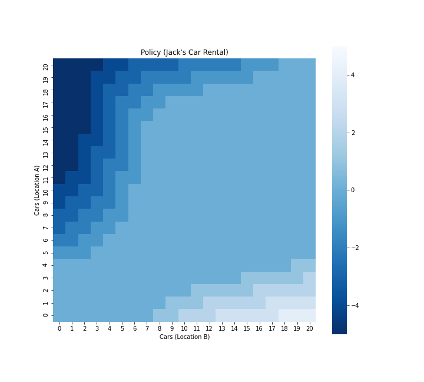
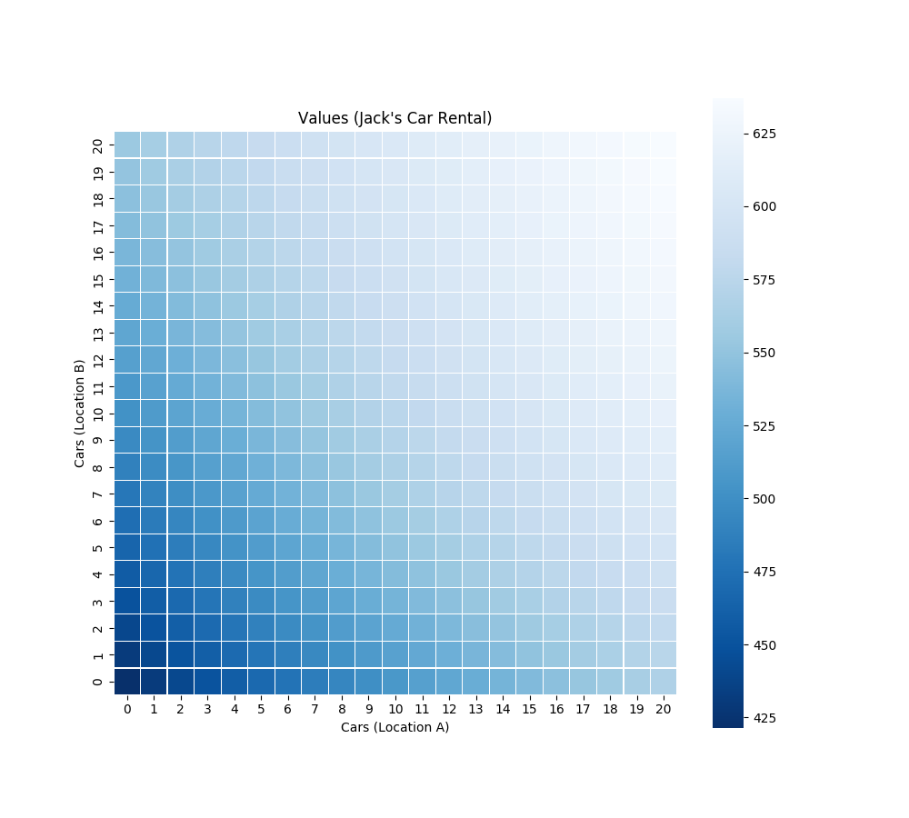

# Jack’s Car Rental Problem

## Problem Description

Jack manages two locations for a nationwide car rental company. Each day, some number of customers arrive at each location to rent cars. If Jack has a car available, he rents it out and is credited  \$ 10  by the national company. If he is out of cars at that location, then the business is lost. Cars become available for renting the day after they are returned. 

To help ensure that cars are available where they are needed, Jack can move them between the two locations overnight, at a cost of  \$ 2  per car moved. We assume that the number of cars requested and returned at each location are Poisson random variables, meaning that the probability that the number is  n  is  $\frac{\lambda^{n}}{n !} e^{-\lambda}$ , where $\lambda$ is the expected number. Suppose  $\lambda$  is 3 and 4 for rental requests at the first and second locations and 3 and 2 for returns. 

To simplify the problem slightly, we assume that there can be no more than 20 cars at each location (any additional cars are returned to the nationwide company, and thus disappear from the problem) and a maximum of five cars can be moved from one location to the other in one night. We take the discount rate to be  $\gamma=0.9$  and formulate this as a continuing finite MDP, where the time steps are days, the state is the number of cars at each location at the end of the day, and the actions are the numbers of cars moved between the two locations overnight.

Given the problem as above, use the policy iteration in the dynamic programming method to calculate the value function corresponding to each state.

## Getting Started

See [notebook](./car_rental.ipynb) to learn about how to solve this problem. The total running time is about 13 seconds.

## Result

The above image shows policy and value function as heatmaps.
